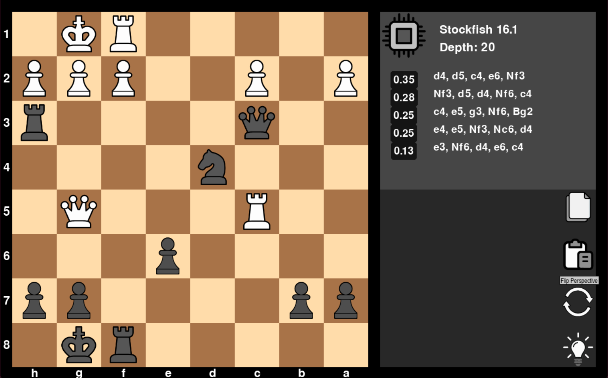

# Chess Game

This project is an implementation of the **Rules of Chess** in Python, using **Pygame** for the graphical interface. The game supports various features such as **FEN Import/Export**, **Engine Analysis** with **Stockfish**, customizable **depth for engine analysis**, **Flip POV**, and a **Light/Dark theme** toggle. It was made for my educational purposes so its not pretty. 

A class used in this code is similar although modified and changed compared to this [github repo](https://github.com/mikolaj-skrzypczak/chess-engine)



## Features

- **FEN Import/Export**: Import and export the board state using the **Forsyth-Edwards Notation (FEN)** format.
- **Engine Analysis**: Utilize the **Stockfish chess engine** to analyze the game position with customizable analysis depth.
- **Undo/Redo**
- **Flip POV**: Flip the board's point of view to play as either player.
- **Light/Dark Theme**: Toggle between light and dark themes for the user interface.

## Prerequisites

- **Python 3.x**

### Required Libraries

- `pygame`
- `pyperclip`
- `psutil`
- `chess`

To install the required libraries, you can use the following command:

```bash
pip install -r requirements.txt
```

## License

This project is licensed under the MIT License - see the [LICENSE](/LICENSE) file for details.
